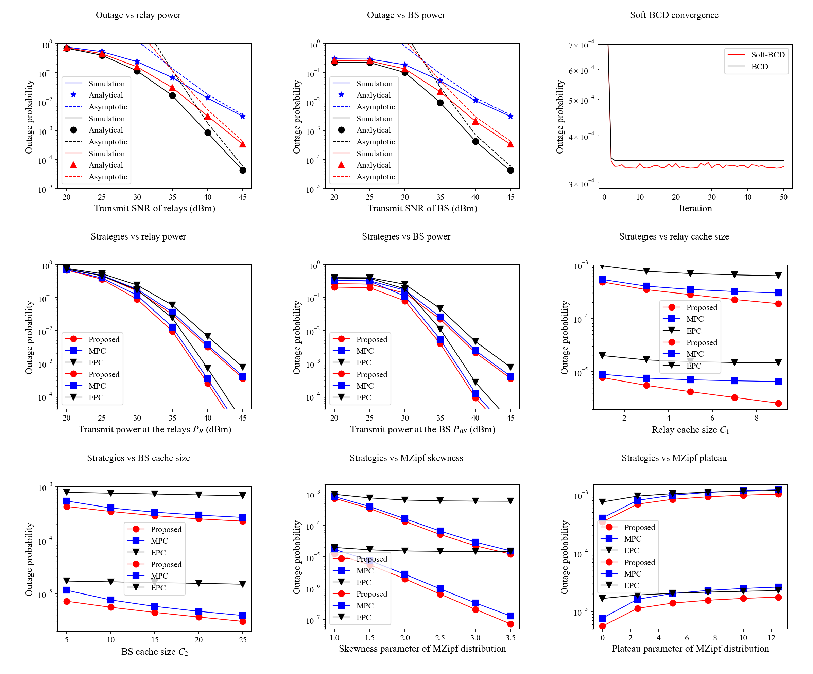

# Collaborative Cache-Aided Relaying Networks

Python code and result artifacts for:

> Shunpu Tang, Ke He, Lunyuan Chen, Lisheng Fan, Xianfu Lei, and Rose Qingyang Hu,
> "Collaborative cache-aided relaying networks: Performance evaluation and system optimization,"
> IEEE Journal on Selected Areas in Communications, vol. 41, no. 3, pp. 706-719, 2023.

## What Is Included

- Python implementation of the outage expressions, Monte Carlo simulations, and cache strategy comparisons.
- One script per result figure under `figures/`.
- A batch entry point: `run_all_figures.py`.
- Generated result CSV/PNG/PDF/EPS files under `results/`.
- Combined experiment result PDF: `results/experiment_results.pdf`.
- Corrected redline manuscript PDF: `paper/corrected_manuscript_redline.pdf`.

The corrected manuscript PDF is included for formula-audit transparency. It is not covered by the MIT code license.

## Core Results

- The analytical outage expressions agree with Monte Carlo simulation over relay-power and BS-power sweeps.
- The high-SNR asymptotic curves converge to the analytical curves in the high-power regime, validating the diversity-order behavior.
- The proposed collaborative caching strategy gives lower outage probability than MPC and EPC across transmit-power, cache-size, and MZipf-popularity sweeps.
- Increasing the number of relays and increasing cache sizes both reduce outage probability; BS-side bottlenecks become visible when BS transmit power is low.
- The Soft-BCD procedure rapidly reduces the objective in the convergence curve. The implementation keeps the final BS cache vector feasible by quantization.

The figure grid below uses the paper result figures generated by the Python
scripts in `results/`:



## Quick Start

```bash
python3 -m venv .venv
source .venv/bin/activate
pip install -r requirements.txt
python run_all_figures.py --samples 200000
```

All published result files in this repository are generated by the Python code.
No paper-figure reference arrays or MATLAB-extracted data are used. Monte Carlo
curves are stochastic; increasing `--samples` improves agreement for small
outage probabilities.

## Run Individual Figures

```bash
python figures/01_analytical_relay_power.py --samples 200000
python figures/02_analytical_bs_power.py --samples 200000
python figures/03_soft_bcd.py
python figures/04_relay_power_strategy.py
python figures/05_bs_power_strategy.py
python figures/06_c1_cache_size.py
python figures/07_c2_cache_size.py
python figures/08_eta_skewness.py
python figures/09_tau_plateau.py
```

## Repository Layout

```text
.
├── figures/                    # one script per result figure
├── paper/                      # corrected manuscript PDF and BibTeX
├── results/
│   ├── experiment_results.pdf  # combined PDF of all result figures
│   └── fig_*.{csv,png,pdf,eps} # per-figure outputs
├── src/cache_outage/           # model, strategies, plotting
├── tools/                      # helper scripts
├── run_all_figures.py
└── requirements.txt
```

## Citation

Please cite the JSAC paper if you use this code or the generated results:

```bibtex
@article{tang2023collaborative,
  title     = {Collaborative cache-aided relaying networks: Performance evaluation and system optimization},
  author    = {Tang, Shunpu and He, Ke and Chen, Lunyuan and Fan, Lisheng and Lei, Xianfu and Hu, Rose Qingyang},
  journal   = {IEEE Journal on Selected Areas in Communications},
  volume    = {41},
  number    = {3},
  pages     = {706--719},
  year      = {2023},
  publisher = {IEEE}
}
```

The same BibTeX entry is also available in `paper/citation.bib`.

## License

The Python code is released under the MIT License. The included manuscript PDF and paper content remain under their respective author/publisher rights; see `LICENSE-MANUSCRIPT.md`.
